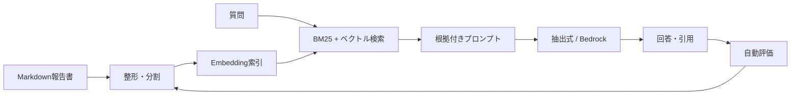

# Space Research RAG Lab

宇宙技術に関する架空の報告書を使い、文書処理からAWS公開までを段階的に学ぶ実習プロジェクトです。Notebookは使わず、Pythonモジュール、CLI、テスト、評価レポートを成果物として残します。

教材の文書・数値・組織はすべて架空です。実在するミッションの判断や設計には使用しないでください。

## 対象者と前提知識

基本対象者は、Pythonの基本文法、関数、リスト・辞書、ファイル操作の基礎を理解し、ターミナルと仮想環境を手順に沿って扱える大学生・社会人です。割合や平均を読めれば十分で、専門的な統計知識は必要ありません。

RAG、Embedding、ベクトル検索、LLM API、画像機械学習、AWSは未経験または初級で構いません。クラス、型ヒント、JSONL、テスト、検索評価指標は実習内で段階的に扱います。

Pythonを一度も書いたことがない人は、現行本編の基本対象には含めません。将来、Python、ターミナル、仮想環境、JSON、テストの基礎を扱う任意のPre-Labを追加する方針です。LangGraphも現在の8 Labには含まれず、必要になった場合は発展Labとして別途設計します。

## このプロジェクトで作るもの

質問を受け取ると関連箇所を検索し、文書ID・ページ・チャンクIDを付けて回答する小さなRAGアプリです。APIキーがなくても、文書加工、Embedding生成、ハイブリッド検索、質問応答、評価まで実行できます。Lab 4でAmazon Bedrockへ切り替え、Lab 8でAWSへ配置します。



## 最短の実行方法

Python 3.10以上だけで、コア実習を動かせます。

```bash
python3 -m venv .venv
source .venv/bin/activate
python -m pip install -e .
rag-lab all
rag-lab ask "火星の砂嵐で太陽電池出力は何%まで低下しましたか？"
rag-lab search "放射線によるビット反転" --mode hybrid
rag-lab summarize europa_comm_2026
```

`rag-lab all` は、生文書の加工、Embedding索引の作成、10問の評価を順に実行します。詳しい結果は `reports/evaluation.json` に保存されます。

インストールせずに試す場合は、各コマンドの先頭を `PYTHONPATH=src python3 -m rag_lab.cli` に置き換えられます。

## 8つの実習

| Lab | 実務工程 | 作るもの | 合格条件 |
| --- | --- | --- | --- |
| 1 | 技術文書の収集・加工 | メタデータ付きチャンクJSONL | 文書ID・ページを失わない |
| 2 | Embedding・ベクトル検索 | 再現可能な索引と検索CLI | 代表5問の検索ヒット率80%以上 |
| 3 | RAG設計・実装 | 検索→生成→引用のパイプライン | 回答から根拠へ戻れる |
| 4 | LLM API連携 | Amazon Bedrock生成器 | API障害と秘密情報を安全に扱う |
| 5 | 検索・要約・QA | CLIと任意のFastAPI | 3機能を別々に実行できる |
| 6 | 精度評価・改善 | ゴールドデータと比較レポート | 変更前後を同じ質問で比較する |
| 7 | プロンプト設計 | v1/v2プロンプト比較 | 引用・拒否ルールを検証する |
| 8 | AWS実行環境 | SAM構成とHTTP API | ログ・権限・費用上限も説明できる |

各Labの手順と課題は [docs/LABS.md](docs/LABS.md)、Cursor Agentへ渡せる小さな依頼文は [docs/CURSOR_AGENT_TASKS.md](docs/CURSOR_AGENT_TASKS.md) にあります。

プロジェクトの決定事項、現在状態、今後のローカル学習アプリ方針は [docs/PROJECT_HANDOFF.md](docs/PROJECT_HANDOFF.md) にまとめています。新しいCodexスレッドへ移行するときは [docs/NEW_THREAD_PROMPT.md](docs/NEW_THREAD_PROMPT.md) を使用してください。

ローカル学習ナビゲーションアプリの初期設計、PDF対応範囲、保存形式、テスト、受け入れ条件は [docs/LOCAL_LEARNING_APP_DESIGN.md](docs/LOCAL_LEARNING_APP_DESIGN.md) にまとめています。

## ローカル学習ナビゲーション

Lab 1はブラウザ画面から進められます。StreamlitとPDF機能を追加し、プロジェクトルートから起動してください。

```bash
python -m pip install -e '.[ui,pdf]'
rag-lab ui
```

画面は`127.0.0.1`だけで待ち受け、Streamlitの利用統計送信を無効にします。全8 Labの状態、Python・PDF環境、Lab 1の学習目標を表示し、「付属Markdown/TXT」と「自分のPDF」のどちらか一方を選べます。

Lab 1では、実行前の予想、加工結果、文書・ページ・チャンク数、出典、実行後の観察、完了条件を順に確認します。PDFでは元PDFとページ別抽出テキストを並べ、警告を確認してから記録します。結果は`.rag_lab/`へ保存され、Git対象にはなりません。

### PDF取り込みCLI

文字レイヤー付きPDFをページ単位で抽出し、既存の`Chunk`形式へ変換できます。PDF機能だけを追加でインストールしてください。

```bash
python -m pip install -e '.[pdf]'
rag-lab ingest-pdf INPUT.pdf \
  --document-id example \
  --title "表示名" \
  --classification user_provided \
  --output .rag_lab/example-chunks.jsonl
```

出力には`document_id`、1始まりの`page`、`section`、`source`が残ります。空ページと20文字未満のページを警告し、空ページ率が20%以上なら`needs_review`になります。文書全体から文字を抽出できないPDFは`OCR_REQUIRED`として終了コード2を返し、チャンクを書き出しません。

対応上限は1件25 MB、200ページで、暗号化されていない文字レイヤー付きPDFが対象です。スキャンPDFのOCR、表・図、一般画像解析はまだ対象外です。元PDFを正解と考えず、ページ表示と抽出テキストを目視比較してください。

PDF結果を`.rag_lab/datasets/<dataset_id>/`へ保存するサービス層も実装済みです。manifest、ページ、チャンク、実行記録、完了検査をdataset単位で保持し、既存datasetを上書きしません。PDF原本は明示指定時だけ`raw/source.pdf`へ保存します。

初期対応は、付属Markdown/TXTと、暗号化されていない文字レイヤー付きPDF 1件です。個人の進捗と実データはGit対象外の`.rag_lab/`へ保存し、生PDFはUIから明示選択された場合だけ保存する設計です。

UI/PDF機能はPython 3.10〜3.12、Windows、macOS、Linuxを対象にし、APIキーやAWS設定なしで動作させます。詳細は設計書を参照してください。

## ディレクトリ

```text
data/raw/                 架空の生文書（編集してよい教材）
data/evaluation/          正解付き質問
data/processed/           Lab 1で生成するチャンク
data/index/               Lab 2で生成するベクトル索引
src/rag_lab/              実装
prompts/                  プロンプトの版
reports/                  評価結果
infra/                    AWS SAM構成
tests/                    回帰テスト
```

## ローカルAPI

```bash
python -m pip install -e '.[api]'
uvicorn rag_lab.api:app --reload
curl -X POST http://127.0.0.1:8000/ask \
  -H 'content-type: application/json' \
  -d '{"question":"蓄電池だけで重要機器を何時間維持できますか？"}'
```

## Bedrockへの切り替え

AWSアカウント、利用可能なモデル、認証情報が必要です。モデルIDは利用するリージョンで確認してください。秘密鍵はソースコードや `.env` へコミットしません。

```bash
python -m pip install -e '.[aws]'
export AWS_REGION=ap-northeast-1
export BEDROCK_MODEL_ID='利用可能なモデルまたは推論プロファイルのID'
rag-lab ask "TMR方式の試験結果を説明してください" --generator bedrock
```

AWS配置は [infra/README.md](infra/README.md) を参照してください。

## テスト

外部パッケージなしでも標準ライブラリのテストを実行できます。

```bash
python -m unittest discover -s tests -v
```

PDF extraが未導入の場合、PDF抽出を必要とするテストだけがskipされます。PDF機能を含む全テストは`python -m pip install -e '.[pdf]'`の後に同じコマンドで実行できます。

任意で開発用ツールを入れる場合:

```bash
python -m pip install -e '.[dev]'
pytest
ruff check .
```

## 最初に観察する失敗

初期の抽出式生成器は、検索結果に似た単語があるだけで「回答可能」と誤判定する場合があります。また、同じ意味の表記揺れ（例: `℃` と `°C`）で文字列評価が下がります。これはバグを隠さず、Lab 6と7で次を比較するための教材です。

- チャンクサイズと検索件数
- dense / BM25 / hybrid
- 正規化した評価と単純な文字列評価
- 回答不能を判定する閾値
- プロンプトv1 / v2
- 抽出式生成 / LLM生成

目標は「一度だけ良い回答を出すこと」ではなく、失敗例を再現し、修正が別の質問を悪化させていないと説明できることです。
